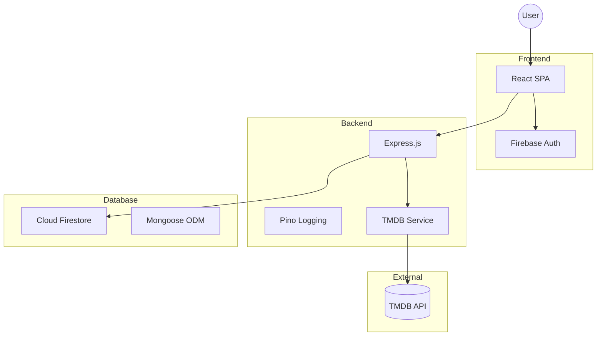

# MovieNight 🍿

MovieNight is a full-stack, cloud-native web application designed to help users discover movies, manage personal preferences, and generate tailored recommendations based on streaming availability.

## Architecture



* **Frontend:** Built with React, Vite, and modern CSS featuring glassmorphism. Secured with **Firebase Authentication** for private user accounts.
* **Backend:** Built with Node.js and Express. Integrated with **Google Cloud Firestore (via MongoDB API)** using **Mongoose** for scalable, serverless data storage.
* **External API:** Integrates with [The Movie Database (TMDB)](https://developer.themoviedb.org/docs) for real-time movie discovery.
* **Household Profiles:** Supports multiple profiles per household (Adult/Child), enabling isolated preferences and watchlists for every family member.
* **Smart Algorithms:** Features a "Date Night" engine that cross-references any two household profiles to find mutual recommendations.
* **Deployment**: Pre-configured for **Google Cloud Run** (Backend) and **Firebase Hosting** (Frontend).

## Getting Started

### Prerequisites
* Node.js (v18+ recommended)
* A TMDB API Key and Read Access Token
* A Firebase Project with **Firestore MongoDB API** and Authentication enabled

### Configuration
1. **Backend**: Create `backend/.env` with your `MONGODB_URI`, TMDB credentials, and add your `service-account.json`.
2. **Frontend**: Create `frontend/.env` with your Firebase Web Config.

### Running the Application
1. **Start the backend:**
   ```bash
   cd backend
   npm install
   npm start
   ```
2. **Start the frontend:**
   ```bash
   cd frontend
   npm install
   npm run dev
   ```
3. Open `http://localhost:5173`!

## Testing
Comprehensive testing is implemented across the stack:
* **Backend Tests (Jest + Supertest):** `cd backend && npm test`
* **Frontend Tests (Vitest + React Testing Library):** `cd frontend && npm test`

## Deployment
- **Backend**: `gcloud run deploy movienight-backend --source .`
- **Frontend**: `npm run build && firebase deploy`
